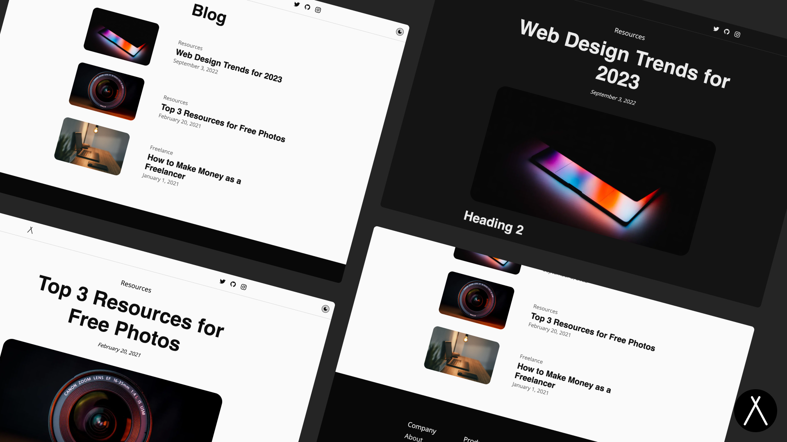

<p align="center">
  
</p>

<br/>
<div align="center">
  <a href="https://twitter.com/littlesticksdev">
  
</a>
  <a href="https://buy.stripe.com/9AQ3f202Jg2f9UcfYY">
    
  </a>
  <a href="https://littlesticks.dev/discord">
    
  </a>
  
</div>
<br/>

# Simple Blog

This is a blog theme/template for Astro. It is based on the [excellent blog template](https://blog.framer.website/) by Framer.

## Features

- ✅ SEO friendly
- ✅ Modern Design
- ✅ Modern CSS Reset via Andy Bell
- ✅ Fluid typography scaling via Utopia
- ✅ Base and Page Layouts
- ✅ A code block component with syntax highlighting and a copy button
- ✅ Automatic Sitemap

## Get Started 

Customize the global site settings such as the title and description in the `src/data/settings.ts` file

<p>
  <a href="https://stackblitz.com/github/littlesticks/REPLACEME">
  
  </a>
</p>

OR

## Local Development

```sh
npm i && npm start
```

## Deploy

Deploy this site to your favorite static hosting service using Astro's docs or quickly deploy to Netlify with the button below 

[](https://app.netlify.com/start/deploy?repository=https://github.com/littlesticks/REPLACEME)
